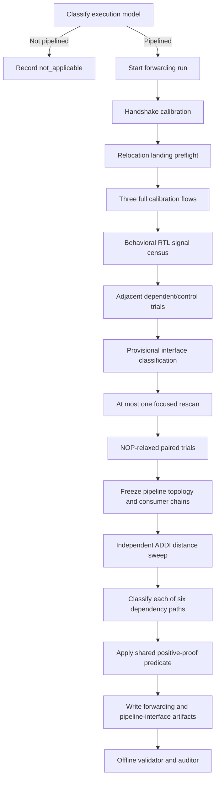

# Forwarding Detection Workflow

## Current implementation

The current implementation is:

- forwarding schema: `2`;
- probe suite: `paired-forwarding-v8`;
- forwarding implementation revision: `11`;
- pipeline-interface schema: `4`;
- pipeline-interface discovery: `dynamic-stage-signals-v4`.

The detector is intentionally conservative. It does not declare forwarding
merely because a dependent program produces the correct result or finishes
without an obvious stall. It tries to prove all of the following:

1. the dependent and control programs are architecturally correct;
2. the dependency adds no latency relative to a layout-matched control;
3. the exact consumer token is present in a dynamically discovered pipeline
   stage, using relocation-backed PC evidence and an instruction companion
   when one validates;
4. that stage contains the expected source-register selector;
5. the corresponding operand value is captured there;
6. the operand is consumed before the producer is architecturally available
   through writeback;
7. the same internal stage, selector, operand slice, phase, lane, and
   token-relative position survive independent-instruction distance tests.

Only when all seven claims hold does the result become `detected`.

## High-level flow



The pipeline interface is classified globally at most twice:

1. provisionally, after the adjacent trials, to identify missing evidence and
   choose one focused rescan;
2. finally, after adjacent, rescanned, and NOP evidence, to freeze the
   topology and consumer-local chains.

Independent-distance trials do not rediscover or replace the interface. They
validate the already frozen chain incrementally.

## 1. Applicability and simulation setup

The main cocotb labeler first finds the architectural register file and runs
the datapath/pipeline classification. Forwarding tests run only when that
classification says the core is pipelined.

For a non-pipelined execution model the detector writes:

```json
{
  "applicable": false,
  "execution": {"state": "not_applicable"}
}
```

For a pipelined core, one instruction-memory driver and one data-memory driver
are shared by all probes. Every individual trial:

1. selects a new immutable `ProgramSpec`;
2. resets program and data memory;
3. resets the core;
4. loads optional wrapper-exposed internal memories;
5. runs until the expected architectural writes complete or the measurement
   budget expires;
6. records fetches, commits, memory requests, and selected internal RTL
   signals.

The outer process has a 900-second hard per-core timeout and a 180-second
no-progress timeout. Progress is written atomically at compilation,
calibration, rescan, NOP completion, every path/gap/variant group,
finalization, and artifact writing.

## 2. Programs used by the detector

There are three program families:

1. pipeline calibration programs;
2. six paired register-RAW forwarding programs;
3. one store-to-load hazard-handling program.

### 2.1 Handshake calibration

`pipeline_handshake_calibration()` executes:

```asm
ADDI x8,  x0, memory_address
LW   x14, 0(x8)
ADDI x18, x0, completion_marker
```

It runs once with the normal memory response and, when supported, twice with a
one-cycle delayed response. This establishes whether stalls/holds caused by
the external data handshake can be sampled reliably. If recovery cannot be
proven, stall-signal sampling is disabled rather than trusted.

### 2.2 Relocation landing preflight

The detector tries these word-aligned bases in order:

```text
0x40, 0x98, 0x184, 0x254, 0x34c, 0x4d8
```

Each short landing program contains:

```asm
ADDI x8,  x0, unique_setup_marker
JAL  x0,  taken_target
ADDI x17, x0, unique_wrong_path_poison
ADDI x18, x0, unique_completion_marker
```

Reset-entry trampolines point at one executable body. The implementation does
not create executable copies of the body at every candidate base.

A landing is accepted only when:

- its architectural result completes;
- the requested entry is fetched;
- the redirect source and taken target are observed;
- no wrong-path instruction is associated after redirect resolution;
- its observed raw base does not alias an already selected base.

The search stops after three bases are accepted. If fewer than three are
found, one reachable calibration flow may still run for diagnostics, but
PC-backed normalized roles and confirmed forwarding are prohibited.

### 2.3 Full pipeline calibration flow

Three full flows run at the selected non-aliasing bases. Each has unique
register values and includes:

```asm
ADDI x8,  x0, memory_base
ADDI x9,  x0, store_value
ADDI x10, x0, unique_value_0
ADDI x11, x0, unique_value_1
ADDI x12, x0, unique_value_2
ADDI x13, x0, unique_value_3
ADDI x15, x0, unique_value_4
LW   x14, 0(x8)
SW   x9,  4(x8)
ADDI x16, x0, unique_value_5
JAL  x0,  taken_target
ADDI x17, x0, wrong_path_poison
ADDI x18, x0, completion_marker
```

This one flow supplies known tokens for:

- straight-line instruction progression;
- register source IDs and operand values;
- a load response;
- a store address and store-data value;
- a taken redirect and a wrong-path poison;
- architectural completion.

Values and encodings vary across flows so a counter, predictor index, constant
field, register ID, immediate, result, or cached value cannot pass merely by
coincidence in one program.

### 2.4 The six forwarding paths

The detector tests these paths independently:

| Probe | Producer | Consumer | Consumer use |
|---|---|---|---|
| `alu_to_alu` | `ADDI` result | `ADDI` | execute operand |
| `alu_to_store_data` | `ADDI` result | `SW` | store data (`rs2`) |
| `alu_to_store_address` | `ADDI` result | `SW` | store address (`rs1`) |
| `load_to_alu` | `LW` result | `ADDI` | execute operand |
| `load_to_store_data` | `LW` result | `SW` | store data (`rs2`) |
| `load_to_store_address` | `LW` result | `SW` | store address (`rs1`) |

Each test is a pair, not a single program:

- the **dependent** program makes the consumer read the producer register;
- the **control** program makes the consumer read a separately initialized
  control register.

The two programs otherwise have the same layout and execute the same producer
and spacer instructions. This is how the detector isolates dependency cost
from ordinary pipeline, fetch, memory, and completion latency.

#### Common paired layout

Conceptually, each pair has this layout:

```asm
offset 0:   ADDI producer_register, x0, poison_value
offset 4:   ADDI control_register,  x0, control_value
offset 8:   NOP
offset 12:  producer instruction             # ADDI or LW
offset 16:  zero or more spacer instructions
consumer:   dependent or control consumer
afterward:  completion marker when required
```

The old poison value is written before the real producer value. This helps
distinguish a genuine new result from an old register value or a nearby
control field.

For ALU consumers, the dependent and control programs use different source
registers but the same immediate. For store-data consumers, both stores use
the same address but different source values. For store-address consumers,
the base registers and immediates are constructed differently while producing
the same effective address. This prevents the effective address or store
offset from masquerading as the selected source operand.

#### Five semantic variants

Variants rotate the register triplet:

```text
producer: x1, x4, x7, x10, x13
control:  producer + 1
result:   producer + 2
```

Every variant also receives distinct producer, control, poison, marker,
immediate, address, result, and filler values. The low five bits of semantic
values are deliberately kept different from register IDs. That separation is
important when searching arbitrary packed RTL vectors: a value bus must not
be mistaken for an `rs1`/`rs2` selector and vice versa.

Three dependent/control variants run initially. Variants four and five run
only if the exact frozen stage/source/operand proof is mixed or changes among
eligible trials. Raw timing variation alone does not trigger extension.

### 2.5 Spacer modes

The paired probes use two spacer kinds.

#### NOP spacer

NOPs change producer-consumer instruction distance while minimizing execute
and writeback activity. The detector retains:

- adjacent gap `0`;
- one relaxed NOP gap derived from pipeline depth:
  `max(1, pipeline_depth - 1)`, rounded up to an even gap.

The NOP group helps determine whether an adjacent RAW penalty disappears when
the producer is given more time.

#### Independent-instruction spacer

Independent gaps use:

```asm
ADDI filler_register, x0, unique_filler_value
```

There is exactly one filler per gap position. Fillers:

- use unique registers from `x1` through `x15`;
- exclude producer, control, and result registers;
- are identical between the dependent and control programs;
- are included in architectural expectations;
- use values that do not collide with sources, destinations, poison,
  operands, results, addresses, or immediates;
- are forbidden discriminators, not candidate consumer operands.

Unlike NOPs, these instructions occupy execute and writeback resources. They
therefore test whether the selected chain remains identifiable in a realistic
stream of unrelated work.

### 2.6 Store-to-load hazard program

The separate memory-ordering probe is:

```asm
ADDI x1, x0, value
SW   x1, 0(x0)
NOP  ...                     # optional gap
LW   x2, 0(x0)
```

It checks that the younger load observes the older store. This proves correct
store/load ordering or serialization. At the available external interface it
cannot distinguish an internal store-queue bypass from waiting for memory, so
it is reported as `hazard_handling`, not register forwarding.

## 3. How the pipeline interface is discovered

The detector cannot assume signal names such as `if_pc`, `ex_rs1`, or
`mem_wdata` exist. It uses names only to organize and bound traversal; a
signal becomes evidence only by matching the known program behavior.

### 3.1 Behavioral signal census

The observer walks the accessible VPI hierarchy and collects width-compatible
candidates for:

- PCs and instructions;
- valid, stall, and flush controls;
- source and destination register IDs;
- execute operands;
- store data;
- writeback enable, destination, and value;
- packed parents from which virtual bit slices may be extracted.

A lightweight census records activity, transform matches, relocation deltas,
redirect matches, token ordering, lane, and hierarchy. Candidates are then
promoted for detailed tracing primarily by behavioral signature. Hierarchy,
lane reserves, and semantic names are later tie-breakers.

The artifact reports:

- candidates discovered;
- signature-evaluated;
- promoted;
- detailed-traced;
- excluded by the absolute traversal limit.

### 3.2 Relocation-backed PC identity

A PC candidate must implement one fixed affine transform:

```text
byte mode: observed = canonical_pc + bias
word mode: observed = (canonical_pc >> 2) + bias
```

The bias is interpreted modulo the candidate width. One scale and one bias
must explain:

- every exact logical instruction offset;
- all three executed bases;
- exact base-to-base relocation deltas;
- redirect sources;
- taken redirect targets;
- absence of wrong-path association after resolution.

The width must distinguish all selected bases. Truncated or low-bit-only
streams remain diagnostic and cannot establish a normalized PC stage.

This is why a monotonically changing counter is not supposed to become a PC:
matching straight-line order is insufficient without exact relocation and
redirect behavior.

### 3.3 Optional instruction and control companions

PC identity is proved independently. An instruction signal is attached only
if its encoding, fetch epoch, transaction slot, lane, and residence overlap
match the PC token exactly.

Valid and flush companions similarly require validated polarity and token
behavior. A bad instruction, valid, stall, or flush candidate is rejected as
an attachment; it does not erase an otherwise valid relocation-backed PC.

A PC-only stage can therefore establish frontend identity when its
relocation, redirect, lane, and wrong-path proof is complete. A standalone
instruction stream cannot establish frontend PC identity.

### 3.4 Token residence

The detector does not reduce a stage token to one absolute cycle. It records a
residence interval:

- entry cycle and sampling phase;
- held cycles;
- exit cycle and phase;
- valid state;
- flush outcome;
- fetch epoch;
- transaction and slot;
- lane.

Repeated numerical PC values must be paired with exact fetch occurrences.
Ambiguous reuse is rejected. Residence and propagation are bounded by the
pipeline-depth and stage-window limits.

This allows a real stage edge to survive variable latency caused by a valid
stall while still rejecting unrelated samples that happen to contain the same
number.

### 3.5 Progression graph and normalized roles

Candidates become nodes in a per-lane directed acyclic graph. Edges represent
shared exact tokens progressing from one residence to another in an accepted
order.

The canonical progression is chosen using:

1. earliest exact fetch-associated relocation-backed nodes;
2. accepted edge order and maximum shared tokens;
3. exact instruction companions;
4. store-transaction and writeback anchors;
5. operand/source evidence for intermediate consumer roles;
6. semantic names only as a final tie-breaker.

The normalized roles are:

- `frontend`;
- `operand_read`;
- `execute`;
- `memory`;
- `writeback`;
- combined roles such as `execute_memory` when fewer boundaries are exposed.

Tied earliest nodes are intended to remain an ambiguous alternative group
rather than being deleted. A later execute, jump, memory, or retirement signal
must not become frontend merely because earlier candidates tie.

### 3.6 Source-register selector and operand capture

For each consumer use, the detector searches for:

1. a stable `rs1` or `rs2` selector;
2. the corresponding exact operand value;
3. a valid consumer-stage token;
4. exact phase, transaction, slot, and lane association.

The source selector may live at the consumer stage or its immediate accepted
predecessor. The operand must be captured at the consumer stage. A frozen
cross-stage chain therefore records:

- source stage path;
- operand stage path;
- the joining graph edge;
- source-ID path and optional packed slice;
- operand path and optional packed slice;
- sampling phase;
- bounded selector lag;
- residence-relative operand position;
- lane.

Explicit `rs1`/`rs2` fields and stage-local control records receive preference
only after behavioral validation.

Candidates are rejected if they behave like any forbidden semantic:

- instruction encoding;
- PC;
- destination register;
- immediate;
- producer or consumer result;
- writeback traffic;
- effective address;
- cache or predictor state;
- poison;
- independent filler register or value.

### 3.7 Dependency-family eligibility

Every proof denominator uses one immutable eligibility key containing:

- dependency family;
- consumer role;
- selected source side;
- pair role (`dependent` or `control`);
- spacer kind;
- gap;
- variant.

Calibration, handshake, another dependency family, another consumer role, or
the wrong source side is excluded. The paired control remains eligible for
the corresponding family and side.

This prevents, for example, store-address trials from diluting a packed
store-data selector.

### 3.8 Store-transaction-local recovery

Store-data discovery also runs when no frontend PC stage is accepted. It
starts from an external store request whose:

- address;
- value;
- fetch epoch;
- transaction;
- slot;
- lane

identify one unique request across the required dependent/control variants.

Within that bounded transaction window, the detector searches backward for a
stable local `rs2` selector and its exact data capture. If successful, it adds
a `transaction_local_store` node and predecessor edges to the graph.

Such a node may establish a partial memory/store role. It does not substitute
for a frontend or ALU stage, and it can support confirmed forwarding only
when fetch association, selector, operand, availability, and independent
corroboration all pass the same proof predicate.

## 4. Discovery, freezing, and corroboration sequence

### 4.1 Adjacent discovery

For every forwarding path, the detector first runs three dependent/control
pairs at gap `0`. These trials are the only forwarding trials used to select
the canonical source-ID and operand chain.

### 4.2 Provisional classification and focused rescan

The first global pipeline finalization identifies missing categories such as:

- stage token;
- source ID;
- operand capture;
- producer availability;
- lane identity;
- transaction association.

The observer may promote a bounded reserve of candidates for the affected
paths. It then reruns adjacent trials for those paths exactly once. The old
adjacent traces become discovery-only evidence.

### 4.3 NOP validation and topology freeze

Each path receives one relaxed NOP group. The second and final global pipeline
classification then chooses:

- normalized stage topology;
- canonical consumer stage;
- source selector;
- operand path and slice;
- phase and lane;
- selector lag;
- joining edge;
- residence-relative position.

The NOP group must validate this selection. The topology is marked frozen.

### 4.4 Independent-distance sweep

Each path then runs independently at gaps `1` and `2`. It continues until:

- two consecutive gaps prove the producer was architecturally available
  before exact consumer operand use; or
- the limit `min(pipeline_depth + 1, 8)` is reached; or
- an architectural construction/execution failure safely terminates the path.

A deterministic monotonic failure affecting both dependent and control roles
stops immediately with `architectural_gap_failure`. Otherwise the same
milestone must fail across two consecutive gaps.

Only newly completed trials are enriched and compared with the frozen chain.
Historical evidence is not globally rediscovered after every gap.

Every completed independent group must retain exactly one chain signature:

- stage path;
- source-ID path;
- operand path;
- source and operand stages;
- joining edge;
- packed slices;
- phase;
- lane;
- bounded selector lag;
- bounded token-residence position.

An incomplete or changed group prevents a confirmed positive. It does not
erase a valid adjacent observation; that observation remains
`possible_forwarding`.

### 4.5 NOP-versus-independent comparison

The artifact compares the relaxed NOP group with the independent group at the
same gap when both exist.

Timing states are:

- `comparable`;
- `gap_not_tested`;
- `nop_timing_unavailable`;
- `independent_timing_unavailable`.

`timing_divergence` is only `true` or `false` when both penalties are numeric.
Otherwise it is `null`. Requirement-state divergence follows the same
available/unavailable discipline.

## 5. How a path is classified

Classification is path-specific. The important outputs are `status`,
`present`, `zero_delay_behavior_observed`, `forwarding_required`, and
`zero_delay_classification`.

### 5.1 Architectural correctness comes first

Both dependent and control variants must complete consistently. Store probes
also require the external store request, address, and value to be observable
when those facts are used.

If execution is incomplete or inconsistent, the result is `inconclusive`.

If the control succeeds but the dependent program fails in one stable,
architecturally observable way, the result may become:

```json
{
  "status": "not_detected",
  "present": false,
  "absence_evidence_validated": true
}
```

This is a strong path-specific negative. A missing internal signal alone is
never absence evidence.

### 5.2 Matched timing penalty

For each group:

```text
RAW penalty = median(dependent latency) - median(control latency)
```

The dependent and control latency ranges must each be stable within one cycle.

A positive adjacent penalty with correct architectural results means the
dependency was handled by waiting:

```json
{
  "status": "stall_handled",
  "present": false
}
```

The relaxed NOP trial indicates whether the penalty disappears after an
interlock distance or persists as a more general stall.

### 5.3 Equal timing is necessary but insufficient

When the adjacent penalty is zero:

- if producer writeback precedes exact operand use, forwarding was not needed;
- if exact operand-use ordering is missing, the behavior is only possible
  forwarding;
- if operand use is proven before writeback, forwarding was required, but all
  exact proof and independent corroboration must still pass.

The outcomes are:

| Situation | `status` | `present` | `zero_delay_classification` |
|---|---|---:|---|
| Equal timing, producer already available | generally `inconclusive` | `null` | `forwarding_not_required` |
| Equal timing, internal proof incomplete | `inconclusive` | `null` | `possible_forwarding` |
| Equal timing, pre-writeback use and complete proof | `detected` | `true` | `confirmed_forwarding` |

### 5.4 Shared positive-proof predicate

The online classifier and offline auditor call the same
`validate_forwarding_positive()` predicate. A positive requires:

- three or five complete matched adjacent variants;
- stable adjacent zero-delay behavior;
- `forwarding_required: true`;
- `consumer_token_proof: true`;
- `source_selector_validation: true`;
- `operand_differential_validation: true`;
- `semantic_discriminators_passed: true`;
- valid revision-11 pipeline identity and graph ordering;
- independent gaps beginning with `[1, 2]`;
- three or five complete pairs in every completed gap;
- exact proof in every gap;
- one unchanged chain signature and bounded lag/residence position.

For PC-backed stages, pipeline identity additionally requires:

- three completed non-aliasing relocation landings;
- relocation roles explicitly permitted;
- a valid byte or word affine transform;
- exactly three distinct bases;
- all relocation delta checks matched;
- no transform rejection.

For transaction-local store stages it requires exact store epochs and exact
fetch associations.

If a raw positive lacks any requirement, `enforce_forwarding_positive()`
downgrades it to:

```json
{
  "status": "inconclusive",
  "present": null,
  "zero_delay_classification": "possible_forwarding"
}
```

The missing proof categories are preserved for diagnosis.

## 6. How to answer “does this core have forwarding?”

The technically correct answer is per dependency path, not one unconditional
boolean for the whole core.

Use this interpretation:

| Artifact result | What can be said |
|---|---|
| At least one path has `present: true` and `status: detected` | The core has confirmed forwarding on those named path(s). |
| A path has `status: stall_handled` | That dependency is correct but added latency; no forwarding was observed for that trial shape. |
| A path has validated `not_detected` | The tested path has strong architectural evidence against the required bypass. |
| A path has `possible_forwarding` | Zero-delay behavior exists, but the internal chain or pre-writeback requirement is not fully proven. |
| A path is `inconclusive` without zero delay | The experiment cannot decide that path. |
| The suite is `not_applicable` | The core was not classified as pipelined; the forwarding detector did not run. |
| The execution failed or timed out | There is no fresh forwarding conclusion. |

A recommended core-level summary is:

```text
confirmed_forwarding
    if at least one path is detected;

no_tested_forwarding
    only if every relevant path has a validated negative;

inconclusive
    if there is no confirmed positive and any relevant path remains possible
    or unresolved;

not_applicable
    if forwarding testing was skipped for the execution model.
```

It is unsafe to label a core “no forwarding” merely because no path was
detected. Missing stage tokens or operand signals reduce observability; they
do not prove hardware absence.

Similarly, a `confirmed` pipeline interface does not itself mean forwarding
exists. It only means the detector knows where and when to look.

## 7. Output artifacts

For a core named `CORE`, the primary outputs are:

### `CORE_labels.json`

The `forwarding` section contains:

- run lifecycle, versions, and phase timing;
- one result for each of the six paths;
- adjacent and relaxed compact experiments;
- independent-distance sweep policy and per-gap evidence;
- zero-delay and forwarding-required states;
- exact proof fields;
- missing-proof categories;
- inferred distance boundaries;
- NOP-versus-independent comparison.

The `hazard_handling.store_to_load` section is separate from register
forwarding.

When cycle debugging is enabled, `forwarding_debug` also retains fuller probe
traces. Normal compact artifacts omit raw traces.

### `CORE_pipeline_interface.json`

This contains:

- landing-base selection;
- calibration and capability coverage;
- behavioral census counts;
- accepted stages;
- address transforms and token residence evidence;
- stage graph and canonical path;
- execute, store-address, and store-data role evidence;
- source-ID linkage diagnostics;
- exact-capture failures;
- transaction-local store nodes;
- focused-rescan and topology-freeze metadata.

### `CORE_analysis_progress.json`

This is the atomic progress heartbeat used by the hard and idle watchdogs. On
failure it preserves the timeout kind, budgets, last phase/path/gap, elapsed
time, and cleanup outcome.

## 8. Validation and auditing

Two repository scripts check completed results:

```bash
python3 scripts/validate_forwarding_regressions.py OUTPUT_ROOT
python3 scripts/audit_forwarding_results.py OUTPUT_ROOT
```

The regression validator checks version freshness, lifecycle completion,
pipeline finalization count, topology freezing, calibration fields, affine
PC proof, graph ordering, store epochs, exact proof fields, sweep
corroboration, and source-grounded expectations.

The auditor:

- re-evaluates every serialized positive with the shared proof predicate;
- can downgrade unsupported positives with `--apply`;
- checks that negative store results have stable observable architectural
  failure rather than missing-interface evidence.

## 9. Current project state and known limitations

In the latest 17-core revision-11 canary run:

- all 17 simulations completed;
- no path was serialized as `detected`;
- 39 path results retained `possible_forwarding`;
- 11 paths were classified as `stall_handled`;
- only one pipeline interface was `confirmed`;
- seven cores exposed no accepted stage;
- only four of 102 path sweeps validated independent corroboration.

Therefore the current canary result is not “these cores have no forwarding.”
It is “revision 11 produced no fully proven forwarding positive in this
canary set.” In several cases, behavior remains consistent with forwarding
but the pipeline interface finder cannot yet freeze the required exact chain.

The main current interface-finder limitations are:

1. landing reachability, architectural completion, and redirect rejection are
   still too tightly coupled;
2. affine bias can absorb a one-instruction stage displacement and collapse
   progression edges;
3. narrow predictor indices can still resemble PCs over the selected low
   address domain;
4. tied early graph alternatives can be pruned before complete-path solving;
5. redirect targets are not always linked through stage-relative token
   residence;
6. transaction-local store nodes are recovered but are not consistently
   integrated into final role evidence;
7. the behavioral census still excludes candidates before every discovered
   signal receives an equivalent lightweight evaluation.

These are recall limitations, not reasons to weaken the proof threshold.
Independent corroboration, semantic-collision rejection, family-local
eligibility, and the shared classifier/auditor gate should remain intact while
the interface finder is improved.

## 10. Practical reading examples

### Confirmed forwarding

```json
{
  "status": "detected",
  "present": true,
  "zero_delay_behavior_observed": true,
  "forwarding_required": true,
  "zero_delay_classification": "confirmed_forwarding"
}
```

Interpretation: the named path has a stable zero-cycle dependency penalty, the
consumer used the exact producer value before writeback, and the same
consumer-local chain survived the independent-distance sweep.

### Possible forwarding

```json
{
  "status": "inconclusive",
  "present": null,
  "zero_delay_behavior_observed": true,
  "forwarding_required": null,
  "zero_delay_classification": "possible_forwarding",
  "requirement_missing_proofs": ["stage_token"]
}
```

Interpretation: dependent and control timing is equal, but the internal stage
could not be proven. This is a recall failure or genuine lack of
observability, not a negative hardware result.

### Stall-handled dependency

```json
{
  "status": "stall_handled",
  "present": false,
  "raw_penalty_cycles": 1,
  "architectural_dependency_handled": true
}
```

Interpretation: the core executed correctly but the dependent program took an
extra cycle relative to the control. The tested zero-stall bypass was not
observed.

### Forwarding not required

```json
{
  "zero_delay_behavior_observed": true,
  "forwarding_required": false,
  "zero_delay_classification": "forwarding_not_required"
}
```

Interpretation: equal timing cannot prove forwarding because the producer was
already architecturally available before the consumer captured its operand.
